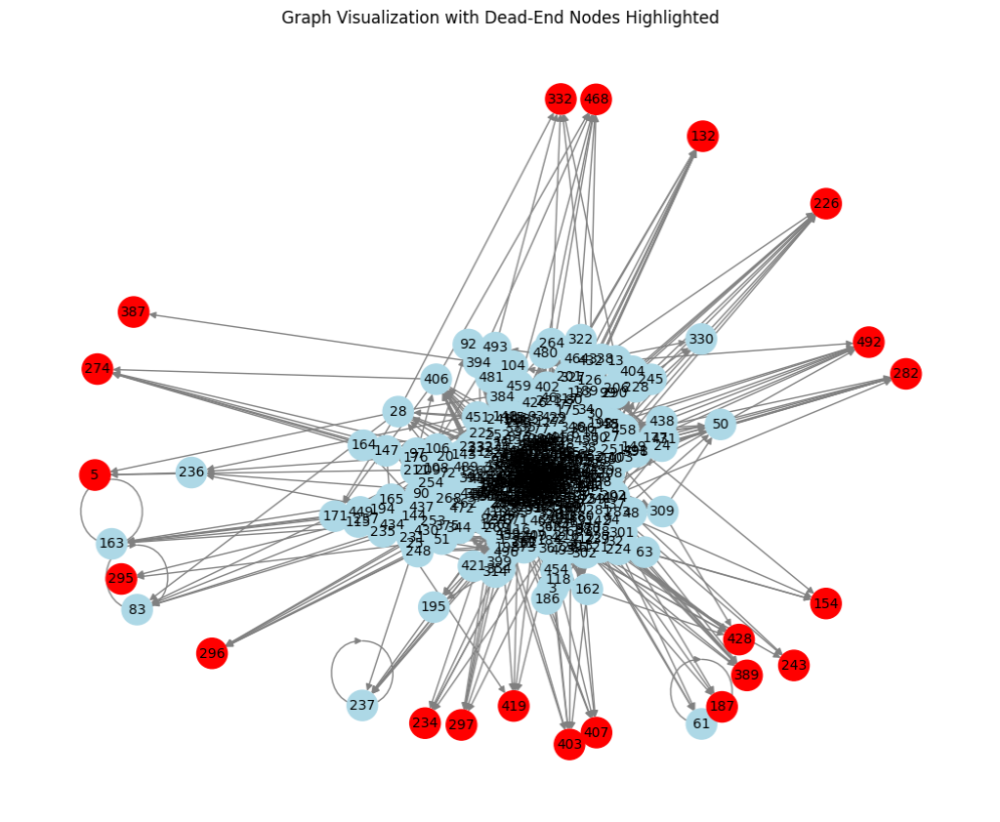
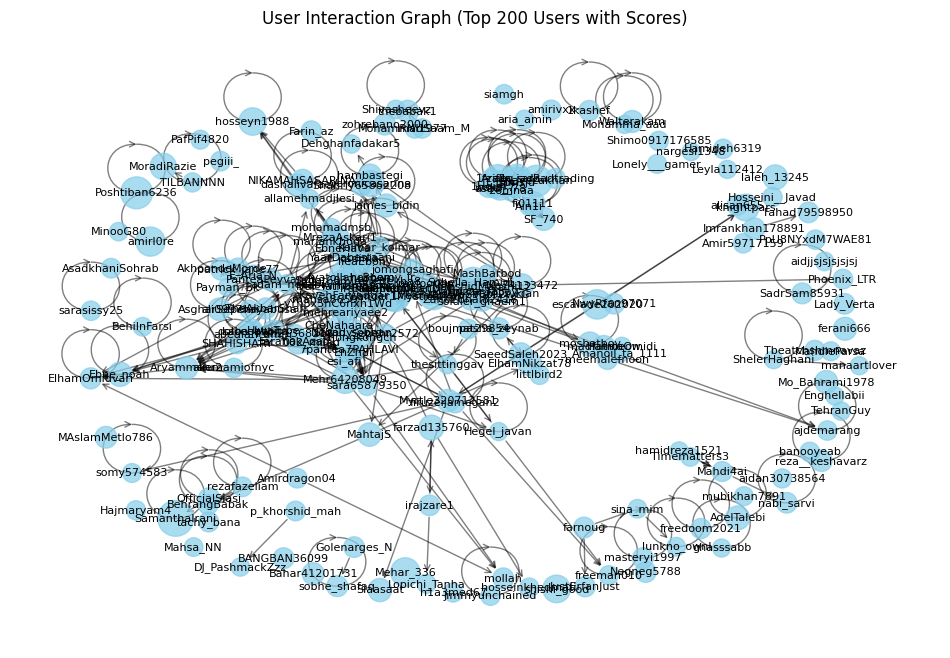

# Graph analysis

## PageRank-HITS(*Graph_Links*) 

- Determining dead-ends of a Graph data-set 
<p align="center">
    
</p>

- Implementing PageRank/HITS algorithm in pyspark framework.  
```markdown
Final PageRank Values:
Node 336: 0.0021227393017690947
Node 408: 0.001825388389825673
Node 200: 0.001732312450658645
Node 368: 0.001026613470545319
...
```
```markdown
Final HITS Values:
Node 12: Hub = 0.27278320630152186, Authority = 0.30765685495417094
Node 24: Hub = 0.07940933739439572, Authority = 0.7048000262044748
Node 36: Hub = 0.4725510985034841, Authority = 0.5267444326313117
Node 48: Hub = 0.17918427547367194, Authority = 0.321584176099179
...
```
## Pixie-TrustRank: Persian tweeter data set(*dataset*)
- Both task description and implementation can be found at *Task2*
- Using the Pixie algorithm,create a graph of users and their interactions.
<p align="center">
    
</p>

```markdown
Pixie Similarity Results (based on random walks starting from 'Armanjasoor'):
User: adam_hesabi, Visits: 19
Pixie Similarity Results (based on random walks starting from 'Armanjasoor'):
User: Ivar_lathbrug2, Visits: 15
Pixie Similarity Results (based on random walks starting from 'Armanjasoor'):
User: _Mahdiyar313, Visits: 14
Pixie Similarity Results (based on random walks starting from 'Armanjasoor'):
...
```
- Using the TrustRank algorithm and calculating Spam Mass, design and implement an algorithm that can detect spam tweets.

```markdown
+--------------------+------------------+
|                text|        spam_value|
+--------------------+------------------+
|دوستانی که ریموت ...|2.3017633100286403|
|به عنوان پزشک، دا...| 6.385299525535547|
|بنا به نظر #وزیر_...|11920.432214382174|
|ظاهراً سازمان اطل...| 3126.438134169463|
|اگر صحبت‌های آ.عج...|  797.080963052442|
...
```

